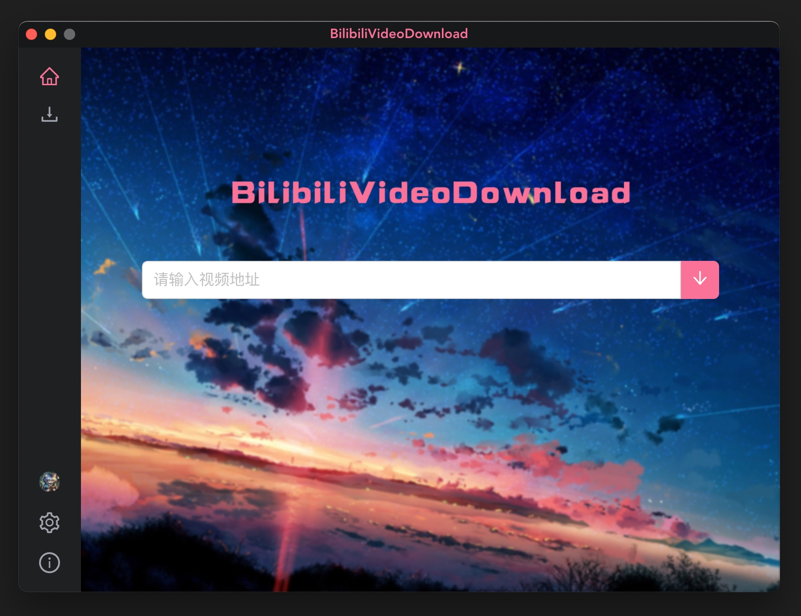
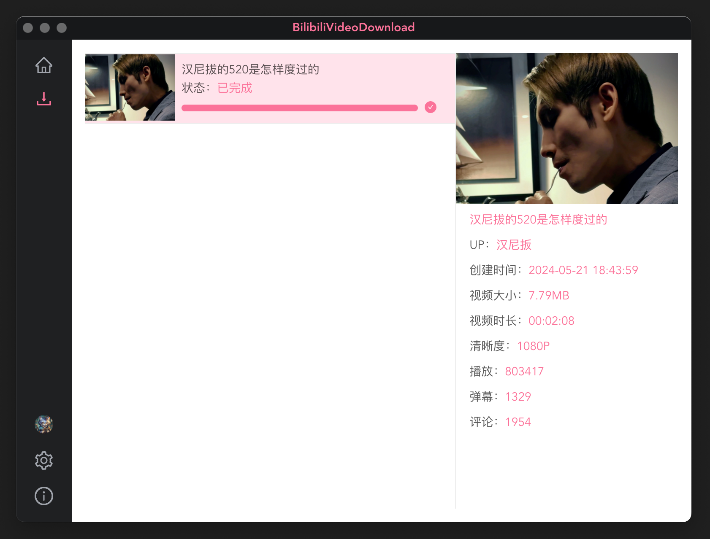
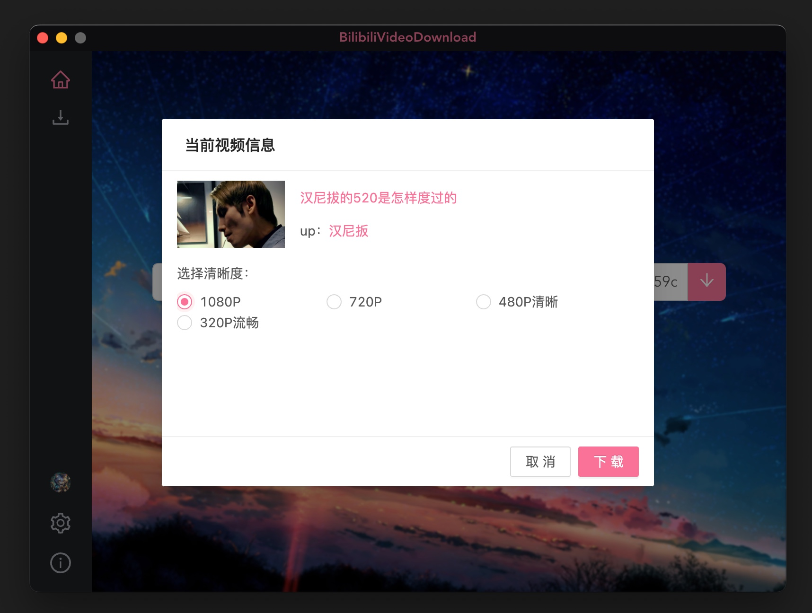

<div align="center">
  
  <h1>BilibiliVideoDownloadFork</h1>
</div>

## ⚠️Bug修复⚠️

***由于[原项目](https://github.com/BilibiliVideoDownload/BilibiliVideoDownload)已经好久没人维护，无人修复bug，因此fork该库修复bug，优化功能体验***

- [x] 🛠️ 修复扫码登录旧接口失效，使用新接口
- [x] 💪 新增新版接口合集视频获取
- [x] 💪 增加下载失败时重新下载按钮
- [x] 💪 优化体验，下载列表右击即选中
- [x] 💪 下载时添加合集目录
- [x] 💪 添加视频列表批量下载
  - 操作: 点击某个up主-> 投稿/合集和列表 -> `播放全部`按钮 -> 进入list页
  - `https://www.bilibili.com/list/...`这种列表链接的解析
  - 用户自己的收藏列表进行批量下载
    1. 进入自己的收藏页
    2. 选择一个收藏列表 -> 点击"播放全部视频"按钮
    3. 跳转到了个人的收藏列表页, 复制该**列表页链接**进行下载即可
    4. ⚠️需要注意的是 用户自己的收藏列表中可能存在已被删除的视频 需移除收藏后才能批量下载
- [x] 🛠️ 修复多任务重复下载任务
- [x] 🛠️ 修复下载失败，右击菜单重新下载时新增任务而不是在原任务的基础上重新下载
- [x] 🛠️ 修复`index out of range: 3 + 99 > 39`, 本质是因为弹幕接口返回-352导致的
- [ ] 🤔 直接下载mp4, 跳过视频音频合并
- [ ] 🤔 下载番剧视频(待定还不知是否做得到)
- [ ] 🤔 暂停/恢复下载
- [x] 🛠️ 2024-12-02修复 "Parse BV Error"(页面结构变动)

## 常见问题

### 打开显示「“xxxx”已损坏，无法打开。 您应该将它移到废纸篓。」

```bash
sudo xattr -d com.apple.quarantine /Applications/BilibiliVideoDownloadFork.app
```

### linux下如果报错SUID sandbox

```txt
The SUID sandbox helper binary was found, but is not configured correctly. Rather than run without sandboxing I'm aborting now. You need to make sure that /opt/BilibiliVideoDownloadFork/chrome-sandbox is owned by root and has mode 4755.
```

解决方案一

```bash
sudo chown root:root /opt/BilibiliVideoDownloadFork/chrome-sandbox
sudo chmod 4755 /opt/BilibiliVideoDownloadFork/chrome-sandbox
```

解决方案二(没尝试过)

```bash
./your-app --no-sandbox
```

## 注意

- 软件不支持付费视频和地区限制视频，可能会报错
- 登录信息有过期时间，好像是半年
- 由于下载的音视频是分离的，项目使用ffmpeg合成导致安装包有点大(ffmpeg大约70+MB)

## 安装

到[releases](https://github.com/gxr404/BilibiliVideoDownloadFork/releases)页面,下载对应平台安装包即可.下载视频时候会提示登录，登录后只会获取你的SESSDATA来用做下载，账号是普通账号最大支持下载1080P视频，大会员可以下载8K视频，不登录最大支持下载480P视频

## 演示




